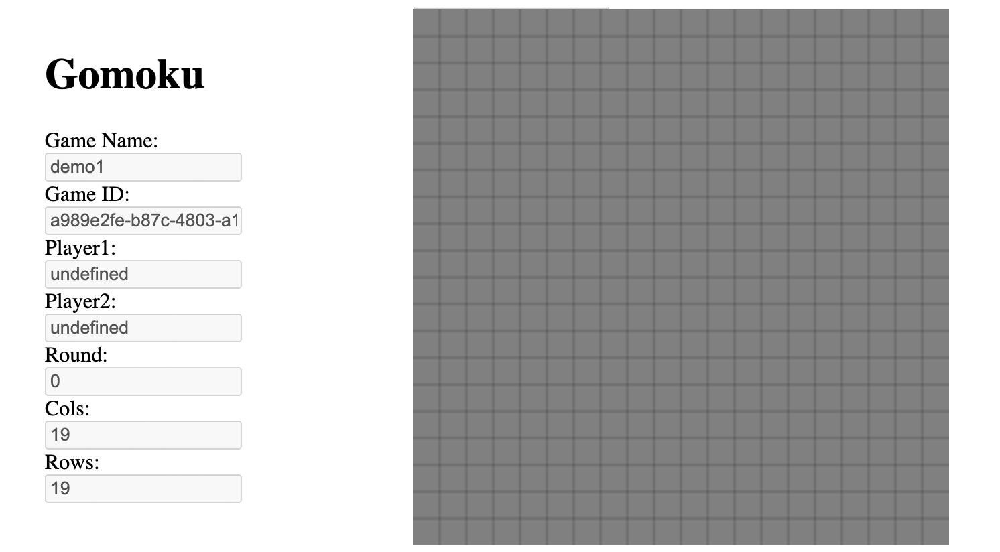

# edu-http-classic-gomoku-js

## Expected time 6:30 minutest

## Info

In this part we will attempt to find requrements for our value-objects. We use a mockup of the game to try to determine what data is required to display a game trough it different states from create to end. We also assume that all methods will return a game object. 

Finally we also deduce that we also need a state attribute to respond to the end states of the game (win/loose, tie).

## Instructions



## ./__tests__/unit_tests.js

```js
/**
 * @group unit
 */

const gameHandler = require('../domain/gomoku.js'); // Object under test

/**
 * Test testing a game object returned by createGame has all
 * necessary attributes.
 */
describe('given gameHandler', () => {
  describe('when creating a game ', () => {
    const game = gameHandler.createGame();
    it('should have expected properties', () => {
      expect(game).toHaveProperty('id'); //Id of game generated server side
      expect(game).toHaveProperty('name'); // A name that is displayed
      expect(game).toHaveProperty('round'); // Which round we currently play
      expect(game).toHaveProperty('players'); // Players
      expect(game).toHaveProperty('rows'); // How many rows our board has got
      expect(game).toHaveProperty('cols'); // How many columns our board has got
      expect(game).toHaveProperty('state'); // state of the game object = {playing, win1, win2, tie}
    });
  });
});

/**
 * Test testing a game object returned by addPlayer has all
 * necessary attributes.
 */
describe('given gameHandler', () => {
  describe('when adding player to a game ', () => {
    const game = gameHandler.addPlayer();
    it('should have expected properties', () => {
      expect(game).toHaveProperty('id');
      expect(game).toHaveProperty('name');
      expect(game).toHaveProperty('round');
      expect(game).toHaveProperty('player1');
      expect(game).toHaveProperty('player2');
      expect(game).toHaveProperty('player');
      expect(game).toHaveProperty('state');
    });
  });
});

/**
 * Test testing a game object returned by playing a round has all
 * necessary attributes.
 */
describe('given gameHandler', () => {
  describe('when creating a game ', () => {
    const game = gameHandler.play();
    it('should have expected properties', () => {
      expect(game).toHaveProperty('id');
      expect(game).toHaveProperty('name');
      expect(game).toHaveProperty('round');
      expect(game).toHaveProperty('player1');
      expect(game).toHaveProperty('player2');
      expect(game).toHaveProperty('player');
      expect(game).toHaveProperty('state');
    });
  });
});

```

### Test it

The test might fail as unit_tests.js contains no tests.

```bash
code .
npm run test:watch  
```
