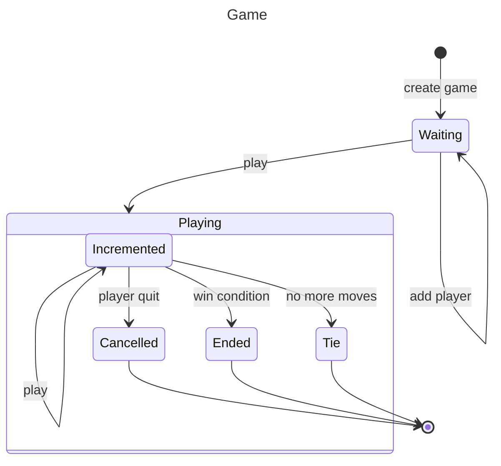

# Requirements

In agile processes user stories are used to identify requirements.

A user story tells, who am I building this for, why am I building it, and what is the testable utility that the user will experience when story is done.

Paramount in the user story is that it must deliver value for the user. It probably is very tempting to make small technical stories that doesn't deliver value, for example register register login  as the functionality is easier to fathom.

A better story is, "As a player I want to play a game of gomoku so that I can win, loose or tie a game.".

To break down the story we are going to use a state diagram. Here is the user story as a state diagram.



## Instructions

We can now write our first unit test derived from the state changes.

### ./__tests__/unit_tests.js

```js
/**
 * @group unit
 */

const gameHandler = require('../domain/gomoku.js'); // Objekt under test

/**
 * Vårt första whitebox-test utifrån tillståndsförändringar i 
 * tillståndsdiagrammet för game.
 */
describe('given gameHandler', () => {
  describe('when using ', () => {
    it('should have expected properties', () => {
      expect(gameHandler).toHaveProperty('play');
      expect(gameHandler).toHaveProperty('addPlayer');
      expect(gameHandler).toHaveProperty('createGame');
    });
  });
});
```
## Test it

Open Visual Studio Code, write the test, and then fullfill the requriements from unit_test.js adding the code to gomoku.js that is missing.

```bash
code .
npm run test:watch
```


```
