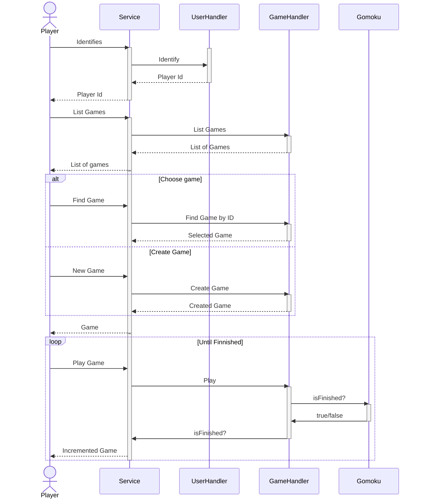

# edu-http-classic-gomoku-js

## Expected time 6:30 minutest

## Info

In this part we will attempt to find requrements for our value-objects. We use a mockup of the game to try to determine what data is required to display a game trough it different states from create to end. We also assume that all methods will return a game object. 

Finally we also deduce that we also need a state attribute to respond to the end states of the game (win/loose, tie).

## Instructions

