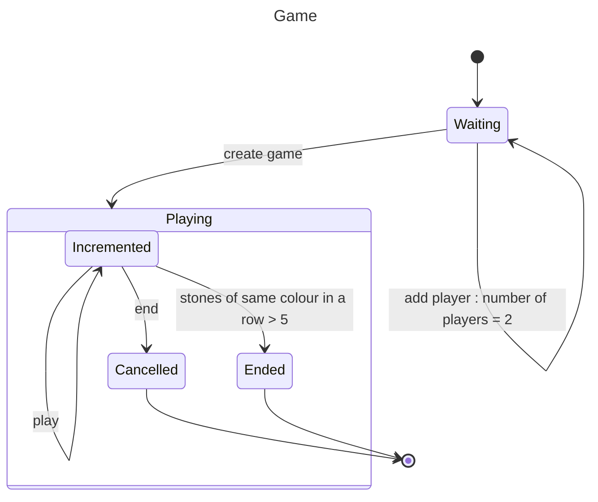

# Requirements

In agile processes user stories are used to identify requirements.

A user story tells, who am I building this for, why am I building it, and what is the testable utility that the user will experience when story is done.

Paramount in the user story is that it must deliver value for the user. It probably is very tempting to make small technical stories that doesn't deliver value, for example register, login or start game as the functionality is easier to fathom.

A better story is, "As a player I want to play a game of gomoku so that I can enjoy a game of Gomoku".

To break down the story we are going to use a state diagram. Here is the user story as a state diagram.

## Instructions
