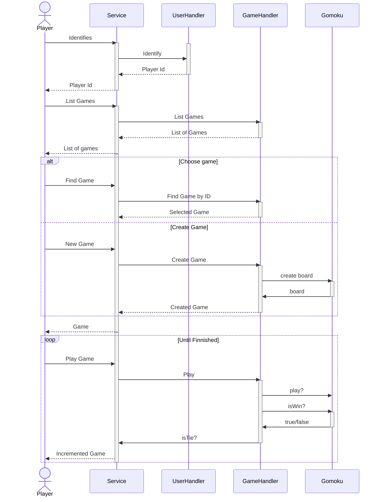

# edu-http-classic-gomoku-js

## Expected time: very time consuming!

## Info

In this part we will attempt to find more detailed requrements, and identify domain objekts. As best it is performed by "dry" running the game, preferable with paper and pen and in a group. 

It probably takes atleast ten to twenty iterations before you have identified all requirements.

The Sequence Diagram is part of UML, and an excellent tool when analyzing detailed requirements.

We find that our GameHandler gets an additional method for listing games, and we also idenfify that we need a UserHandler, and a domain object for the game Gomoku itself. We also notice that very litle is actually the concern of the game itself.

## Sequence Diagram of one game Gomoku.



## Instructions

### Cleaning up files

```bash
git mv ./__tests__/unit_tests.js ./__tests__/game_handler_tests.js
git mv ./domain/gomoku.js ./domain/game_handler.js
touch ./__tests__/user_handler_tests.js
touch ./__tests__/gomoku_tests.js
touch ./domain/user_handler.js
touch ./domain/gomoku.js
```

### user_handler_tests.js

```js
/**
 * @group unit
 */

const gameHandler = require('../domain/game_handler.js'); // Objekt under test

/**
 * Tests added from sequence diagagram
 */
describe('given a gameHandler', () => {
  describe('when using ', () => {
    it('should have expected properties', () => {
      expect(gameHandler).toHaveProperty('findGameById');
      expect(gameHandler).toHaveProperty('saveGame');
      expect(gameHandler).toHaveProperty('getGames');
    });
  });
});
```
### game_handler_tests.js

```js
```
### gomoku_tests.js

```js
```

## Test it

Open Visual Studio Code, write the test, and then fullfill the requriements from the three tests.

```bash
code .
npm run test:watch
```
